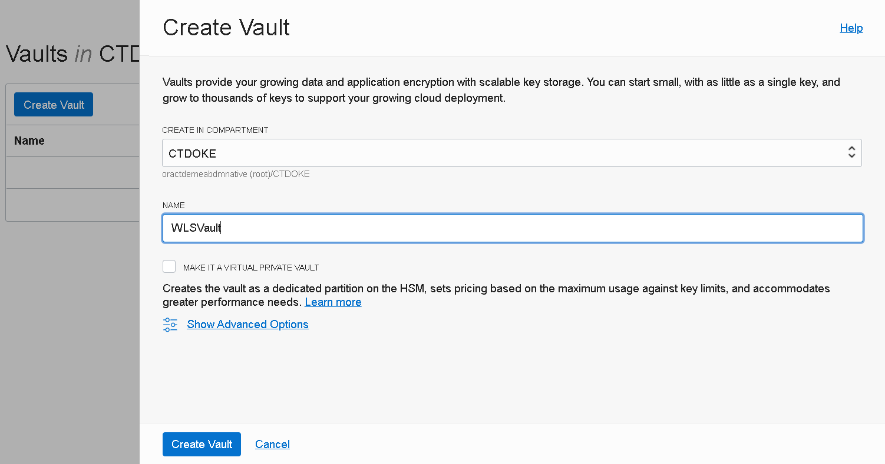
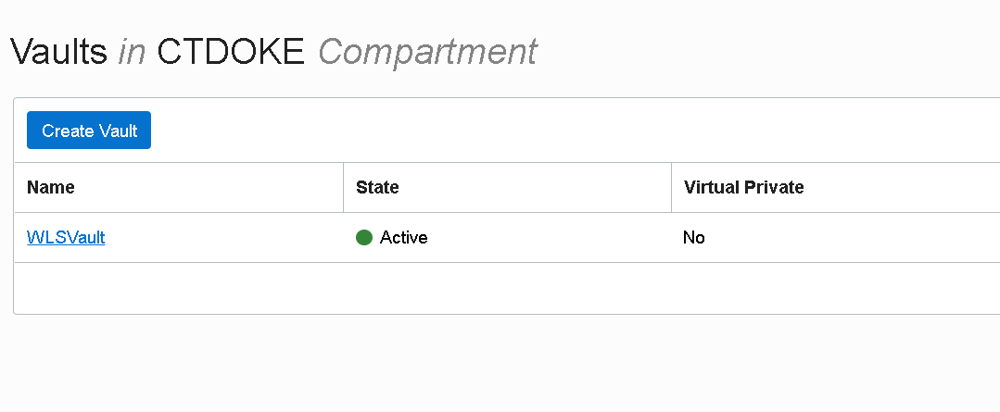
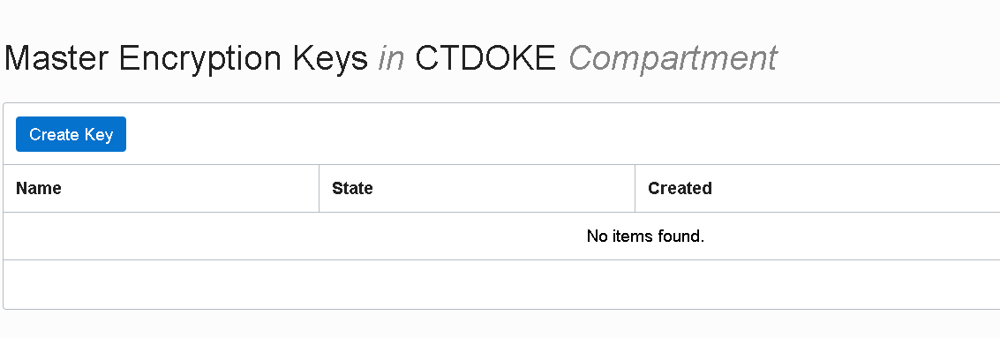
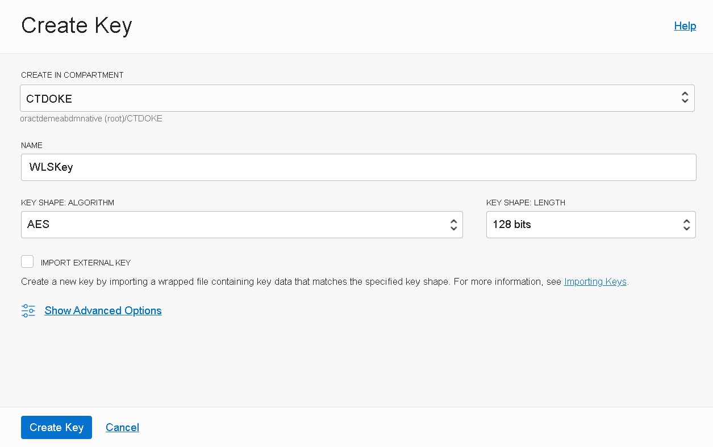
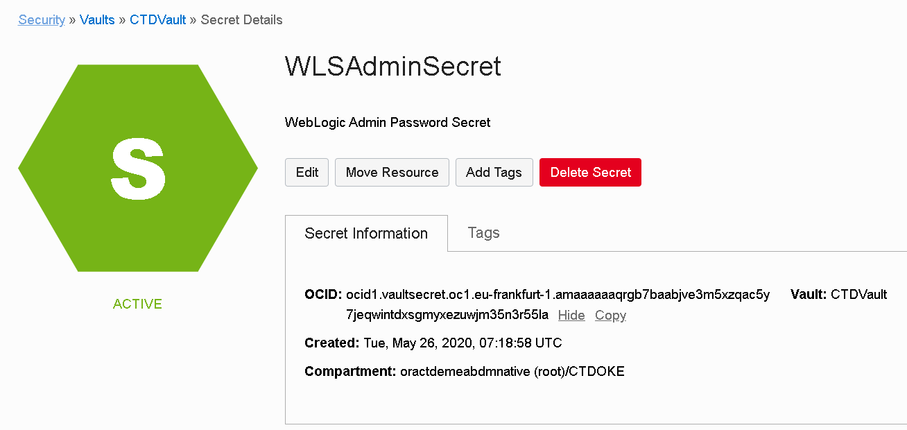
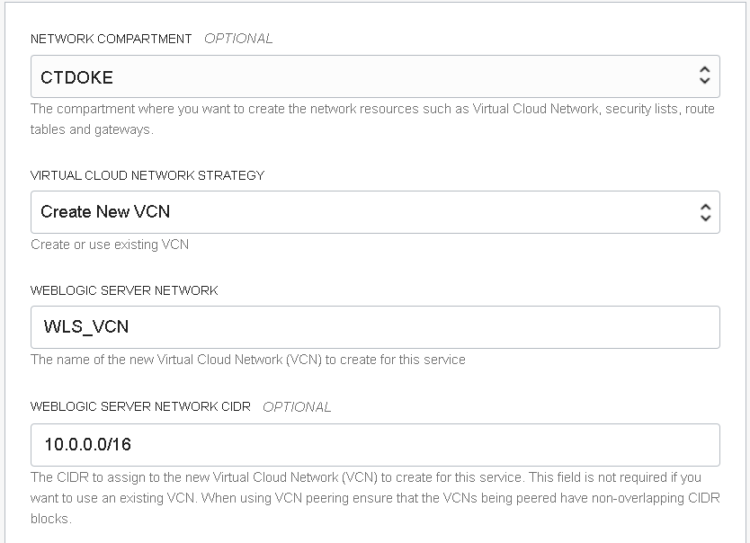
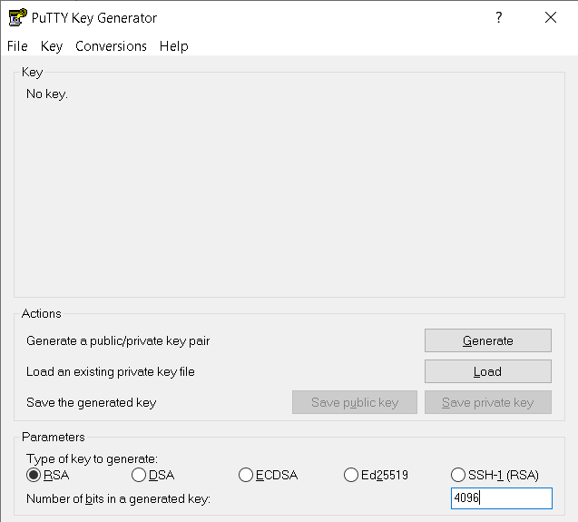

# WebLogic for OCI - non JRF - prerequisites

#### Prerequisites for using own environment
---

## Objective

If you want go through the Hands on Lab (*non JRF type of WebLogic for OCI Instance - using Oracle Cloud Marketplace*) using your cloud environment, follow this guide to setup some prerequisites. If you will use the provided Cloud Test Drive environment, skip this Lab.

## Step 1. Prepare OCI Compartment

When provisioning WebLogic for OCI through Marketplace, you need to specify an OCI Compartment where all resources will be created.

Make sure you have a Compartment that you can use or create a new one.

Take note of the compartment **OCID**:

The Compartment name is referred as **CTDOKE** in the Hands on Lab.

### Required root level policies for WebLogic for OCI

You must be an Oracle Cloud Infrastructure <u>administrator</u>, or <u>be granted some root-level permissions</u>, in order to create domains with Oracle WebLogic Server for Oracle Cloud Infrastructure.

When you create a domain, Oracle WebLogic Server for Oracle Cloud Infrastructure creates a dynamic group and root-level policies that allow the compute instances in the domain to:

- Access keys and secrets in Oracle Cloud Infrastructure Vault
- Access the database wallet if you're using Oracle Autonomous Transaction Processing (JRF-enabled domains)

In case <u>you are not an OCI administrator</u> and you cannot create dynamic-groups or you cannot create policies at root compartment level, please contact your OCI administrator and request that one  of the groups your OCI user is part of to have the following grants in place:

> Allow group MyGroup to manage dynamic-groups in tenancy
> Allow group MyGroup to manage policies in tenancy
> Allow group MyGroup to use tag-namespaces in tenancy

### Required compartment level policies for WebLogic for OCI

If <u>you are not an Oracle Cloud Infrastructure administrator</u>, you must be given management access to resources in the compartment in which you want to create a domain.

Your Oracle Cloud Infrastructure user must have management access for Marketplace applications, Resource Manager stacks and jobs, compute instances, and block storage volumes. If you want Oracle WebLogic Server for Oracle Cloud Infrastructure to create resources for a domain like networks and load balancers, you must also have management access for these resources.

A policy that entitles your OCI user to have the minimum management access for your compartment, needs to have the following grants in place:

> Allow group MyGroup to manage instance-family in compartment MyCompartment
> Allow group MyGroup to manage virtual-network-family in compartment MyCompartment
> Allow group MyGroup to manage volume-family in compartment MyCompartment
> Allow group MyGroup to manage load-balancers in compartment MyCompartment
> Allow group MyGroup to manage orm-family in compartment MyCompartment
> Allow group MyGroup to manage app-catalog-listing in compartment MyCompartment
> Allow group MyGroup to manage vaults in compartment MyCompartment
> Allow group MyGroup to manage keys in compartment MyCompartment
> Allow group MyGroup to manage secret-family in compartment MyCompartment
> Allow group MyGroup to read metrics in compartment MyCompartment

## Step 2. Create OCI Secret for WebLogic Admin password

When you provision WebLogic for you need to pass the WebLogic Admin password. An OCI Secret is required for this.  

### Create a Security Vault

Go to *Governance and Administration* > *Security* > *Key Management*:

Create a new Shared Vault (leave the *Make it a Virtual Private Vault* option unchecked):

The new Vault should be listed as Active:

Take a look at the Vault Information:

### Create an Encryption Key

Go to *Master Encryption Keys* submenu of the Vault Information page and create an new Key:

Give the key a Name and leave the other settings as default:

The new key should be listed as *Enabled*:

### Create an OCI Secret

Go to *Secrets* submenu of the Vault Information page and create an new Secret:

Setup a name for the OCI Secret; choose previously created Encryption Key (**WLSKey**) in the *Encryption Key* dropdown. If you leave default value for *Secret Type Template* (**Plain-Text**), you have to enter the plain WebLogic Admin password in the *Secret Contents* aria. If you switch to **Base64** template, you need to provide the password pre-encoded in base64.

> The password must start with a letter, should be between 8 and 30 characters long, should contain at least one number, and, optionally, any number of the special characters ($ # _).

Shortly, the Secret should be listed as *Active*:

Click on the Secret name and take note of its **OCID**. We need to provide this value in the WebLogic for OCI Stack configuration form:

## Step 3. Network Configuration

The Hands on Lab guide uses an existing Virtual Cloud Network and pre-configured Subnets for the WebLogic compute nodes and for the Load Balancer.

 If running the lab in a different cloud environment, the easiest way is to choose for creation of required network resources during provisioning.

When filling in Stack form choose to *Create New VCN* for Virtual Cloud Network Strategy. Setup a VCN name. You can leave default Network CIDR value or change it.

You can leave default options for Subnet configuration:

Also for the Load Balancer:

##  Step 4. Create ssh keys

You need to generate a public and private ssh key pair. During provisioning using Marketplace, you have to specify the ssh public key that will be associated with each of the WebLogic VM nodes.

You can choose one of the options below:

### Using ssh-keygen

> ssh-keygen -t rsa -b 4096

You'll be asked to specify the filename to save the private key. The public key will be saved at the same location, with the extension .pub added to the private key filename.

### Using PuTTYgen

Launch the PuTTYgen tool and use the *Generate* button to generate a new private/public key pair.

After key generation, don't forget to save the public and private key. If not using Putty as ssh client, you'll need to save the key in OpenSSH format (*Conversions* -> *Export OpenSSL key*).

The public key filename is referred as **wls_ssh_public.key** in the Hands on Lab.

## Step 5. Load balancer SSL configuration

For security reasons it's a good practice - if not mandatory - to allow only secured traffic between clients and WebLogic Server applications. Therefore, after provisioning WebLogic for OCI by choosing to setup a Load Balancer, it's necessary to manually finish SSL configuration by adding a SSL certificate to the load balancer's listener.

### Create Self Signed certificate

We can use Openssl tool to generate a Self Signed certificate:

> openssl req -x509 -newkey rsa:4096 -keyout weblogiccloud_key.pem -out weblogiccloud_cert.pem -days 365

The openssl dialog will request setting up a PEM pass phrase and several fields for certificate information.

You can choose any PEM pass phrase, the one used by the Hands on Lab is referred from the **weblogiccloud_key_passphrase.txt** text file.

Then, we need to decrypt the private key:

> openssl rsa -in weblogiccloud_key.pem -out weblogiccloud_dec_key.pem

Note that above examples use the same names for the certificate and private key as in the Hands on Lab: **weblogiccloud_cert.pem** and **weblogiccloud_dec_key.pem**.

You should be able now to run the Hands on Lab on your own cloud environment.